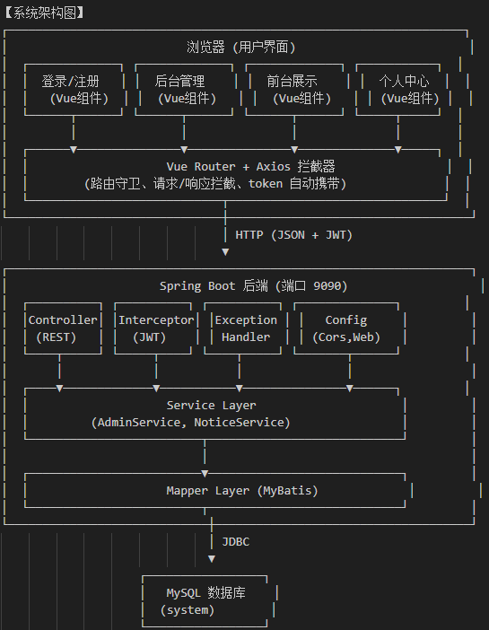
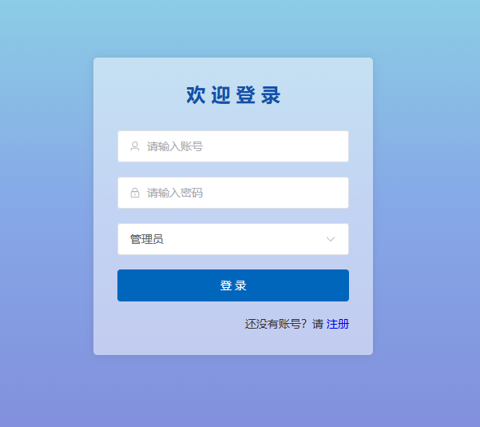
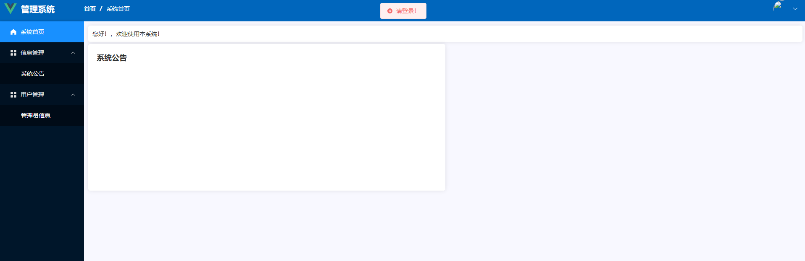
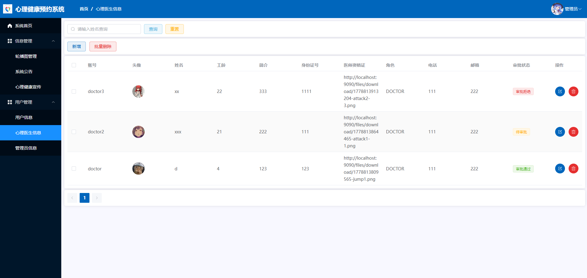
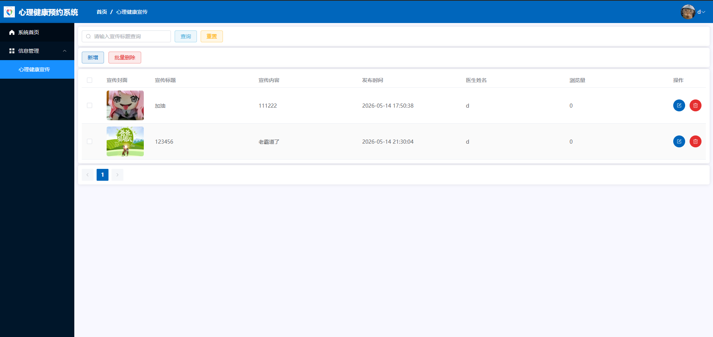
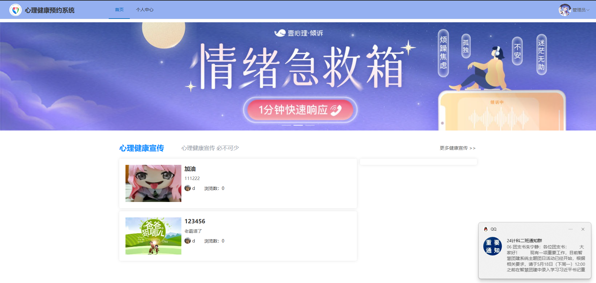
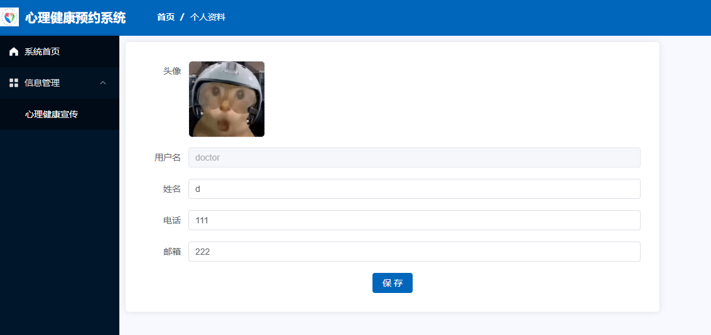
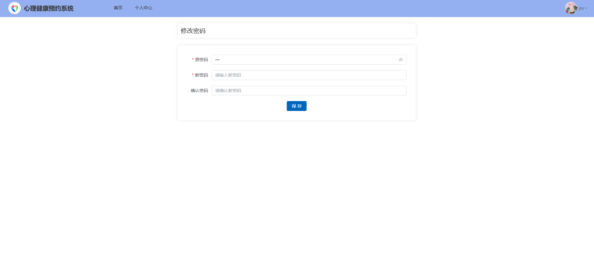
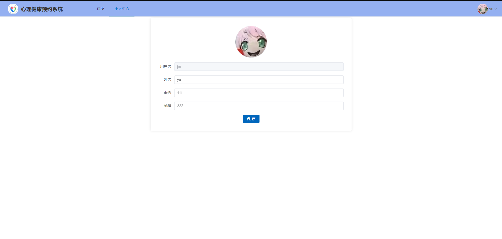
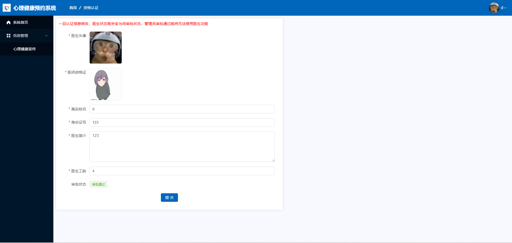

# 软件说明书（中期 / 结项共用主文档）
> 使用说明 
> - 本文档作为**中期检查**与**最终软件说明书**的共用主文档。  
> - **中期阶段**：先完成标注为“中期必填”的内容；标注为“结项补全”的内容可暂留空。  
> - 结项阶段：在中期版本基础上继续补全，整理后导出为最终doc/docx。  
> - 过程性图片请单独存放在项目目录中，如 `ui/` 或 `assets/`，正文中使用相对路径引用。  
> - 过程考核以Git中的md增量记录为主，最终排版稿以导出的doc/docx为准。  

---

## 基本信息
**项目名称：** 心理健康预约与测试系统
**学    院：** 计算机学院
**小组序号：** 10
**成员姓名：** 陈宇轩、厉哲恺、喻眈人
**指导老师：** 尹兆远
**当前版本：** 中期版
**更新日期：** 2026年5月6日
**文件路径：** `docs/report/中期和结项报告.md`

---

## 一、项目概述 【中期必填】

### 1. 项目背景
传统校园与社区心理健康服务存在线下流程繁琐、预约冲突、测试管理混乱、数据统计不便等问题。为实现心理测试、医生预约、宣传管理、数据统计一体化线上服务，开发本心理健康预约与测试系统，满足用户、心理医生、管理员三类角色的全流程业务需求。

### 2. 系统目标
1. 实现管理员角色的登录、权限验证、个人信息管理功能，基于JWT实现无状态认证。
2. 完成系统公告的增删改查与发布管理，支持分页查询与时间记录。
3. 实现管理员信息的增删改查、头像上传、批量删除与分页查询。
4. 搭建前后端分离架构，通过Axios请求拦截与路由守卫实现前端权限控制。
5. 提供文件上传接口，支持图片存储与访问URL返回。
6. 建立统一的全局异常处理与跨域配置，保证系统稳定运行。

### 3. 开发环境
- 架构模式：前后端分离
- 后端：Spring Boot3、Spring MVC、MyBatis、PageHelper
- 前端：Vue3、Vite、Element Plus、Axios、Vue Router、SCSS
- 安全认证：JWT 令牌认证
- 工具库：Hutool 工具集
- 数据库：MySQL
- 开发工具：IDEA、VS Code
- 版本控制：Git + GitHub
- 运行环境：Windows、主流浏览器
---

## 二、需求分析 【中期必填】

### 1. 功能需求
#### （1）管理员功能
- 登录、个人信息、修改密码
- 首页：近一周测试人数统计、题目类型统计
- 轮播图管理、分类管理
- 医生预约记录管理、反馈信息管理、系统公告管理
- 用户信息管理、心理医生信息管理、管理员信息管理

#### （2）心理医生功能
- 登录、注册、个人中心、修改密码、认证信息
- 查看公告
- 预约记录审批、心理健康宣传管理

#### （3）用户功能
- 登录、注册、个人中心、修改密码
- 首页浏览公告、轮播图、宣传、医生、试卷信息
- 查看认证医生、预约医生、查看预约记录
- 查看宣传、提交反馈、管理反馈

### 2. 非功能需求
- 性能：页面响应快，支持多人同时在线
- 安全：角色权限控制、密码加密、接口校验
- 兼容性：支持PC端主流浏览器
- 易用性：流程清晰，操作简单

---

## 三、系统设计 【中期必填】

### 1. 系统架构
采用前后端分离架构：
- 前端：Vue3 + Element-Plus 负责页面渲染
- 后端：Spring Boot3 提供RESTful接口
- 数据库：MySQL 存储业务数据
- 通信：Axios 请求 + JSON 数据交互

【系统架构图】

### 2. 模块设计

#### 前端模块
1. 登录/注册模块：实现ADMIN角色登录、注册功能，包含法律声明弹窗
2. 后台管理模块：提供管理端主框架、顶部导航、侧边栏、退出登录功能
3. 管理员管理模块：管理员信息增删改查、头像上传、批量删除、分页查询
4. 公告管理模块：公告信息增删改查、自动记录发布时间、分页查询
5. 个人资料模块：支持个人信息修改、昵称/电话/邮箱/头像更新
6. 修改密码模块：原密码校验、新密码确认、清空缓存并跳转登录
7. 系统首页模块：展示欢迎信息、轮播显示最新公告
8. 前台首页模块：公告展示、登录注册入口、个人中心快捷访问
9. 路由与请求模块：全局路由守卫、Axios请求拦截、token统一管理

#### 后端模块
1. 管理员模块：提供登录、密码修改、信息管理、分页查询接口
2. 公告模块：提供公告增删改查、自动填充发布时间接口
3. 文件模块：支持图片/文件上传、本地存储、URL返回
4. 认证授权模块：JWT令牌生成与校验、请求权限拦截
5. 全局异常模块：统一异常处理、标准化错误信息返回
6. 配置模块：跨域配置、拦截器配置、Web全局配置

### 3. 数据库设计
本项目采用 MySQL 数据库，根据实际业务需求设计以下核心数据表，所有表结构与后端代码、业务功能完全对应。

#### 核心数据表
1. **管理员表（admin）**
   存储管理员账号、密码、昵称、头像、角色、联系方式等信息，用于系统登录与权限管理。
2. **公告表（notice）**
   存储系统公告的标题、内容、发布时间，支持前台展示与后台管理。

#### 表结构说明
- **管理员表**：id、username、password、name、avatar、role、phone、email
- **通知表**：id、title、content、time

#### 【E‑R 图】
管理员 —— 无直接关联 —— 公告
---

## 四、系统实现

### 1. 关键技术

#### 后端技术
| 技术/框架 | 用途 | 说明 |
| :--- | :--- | :--- |
| Spring Boot 3.3.1 | 应用基础框架，快速构建 RESTful 服务 | 自动配置、嵌入 Tomcat、简化依赖 |
| MyBatis + PageHelper | 数据持久化与分页 | XML 映射动态 SQL，PageHelper 实现物理分页 |
| JWT (java-jwt 4.3.0) | 无状态用户认证 | 登录生成 token，后续请求携带 token 验证身份 |
| Hutool 5.8.25 | 工具类库（文件操作、日期处理、JSON） | 简化 FileUtil、DateUtil 等常用操作 |
| Spring MVC 拦截器 | JWT 统一验证 | JWTInterceptor 前置拦截，排除登录、注册、静态资源路径 |
| CORS 配置 | 允许前端跨域访问 | CorsConfig 允许所有来源、请求头、方法 |

#### 前端技术
| 技术/框架 | 用途 | 说明 |
| :--- | :--- | :--- |
| Vue 3 | 渐进式 JavaScript 框架 | 使用组合式 API（`

(4) 管理员列表分页查询（前端）
<!-- Admin.vue -->

(5) 文件上传前端的处理
<el-upload
    :action="baseUrl + '/files/upload'"
    :on-success="handleFileUpload"
    :show-file-list="false"
>
  
  <el-icon v-else class="avatar-uploader-icon"><Plus /></el-icon>
</el-upload>

（6）后端 JWT 生成（TokenUtils）
public static String createToken(String data, String sign) {
    return JWT.create().withAudience(data)
            .withExpiresAt(DateUtil.offsetDay(new Date(), 1))
            .sign(Algorithm.HMAC256(sign));
}

（7）后端登录接口返回 token
// AdminService.java
public Admin login(Account account) {
    // ... 验证用户名密码
    String token = TokenUtils.createToken(dbAdmin.getId() + "-" + dbAdmin.getRole(), dbAdmin.getPassword());
    dbAdmin.setToken(token);
    return dbAdmin;
}

---

## 五、系统测试 【中期先写方案】

### 1. 测试方案
对登录、权限、出题、答题、预约、审核、统计等核心功能进行功能测试与流程测试。

### 2. 测试结果
中期正在进行模块测试，完整结果结项补充。

### 3. 问题与改进
开发正常，后续优化交互体验与并发性能。

---

## 六、用户手册 【结项补全】
（中期暂不填写）

---

## 七、项目总结 【中期可先写阶段总结】

### 1. 成果总结
已完成需求分析、系统设计、数据库设计、前后端骨架搭建、核心模块开发，Git提交正常，达到中期检查要求。

### 2. 不足与改进方向
部分业务逻辑需完善，前后端联调持续推进，后续完善测试与界面优化。

### 3. 成员分工表
- 陈宇轩：后端开发、接口、数据库设计
- 厉哲恺：前端开发、Vue3、Element-Plus、页面与交互
- 喻眈人：测试、文档编写、Git管理、功能验证

### 4. Git 提交记录

---

## 附录
- 源代码仓库地址：https://github.com/JMJM666/xinxishijian
