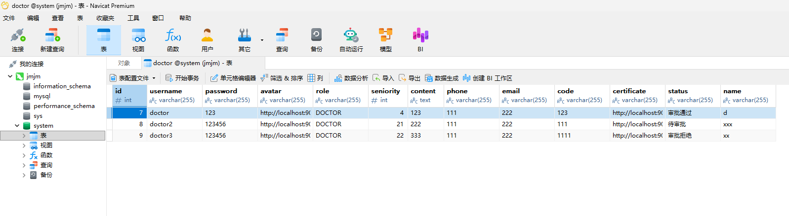

# 修复验证记录

预先说明：详情问题见bug记录

1.经过重新检查一遍代码，以及向AI求助
代码，错误处的注释，发现是代码中存在
多处将 role 值（'DOCTOR'）错误写入其
他字段的问题。修改数据库后解决。

修复后截图：

2.心理医生资质界面不显示，不同于上面的
sql问题，这次就是前端的问题，后面发现是
纯代码敲错了，在doctor.vue文件中有定义
前后没照应，然后也有自闭包的，后面改正了
因为与上一个问题部分一致，所以最终结果也
一致

修复后截图：

